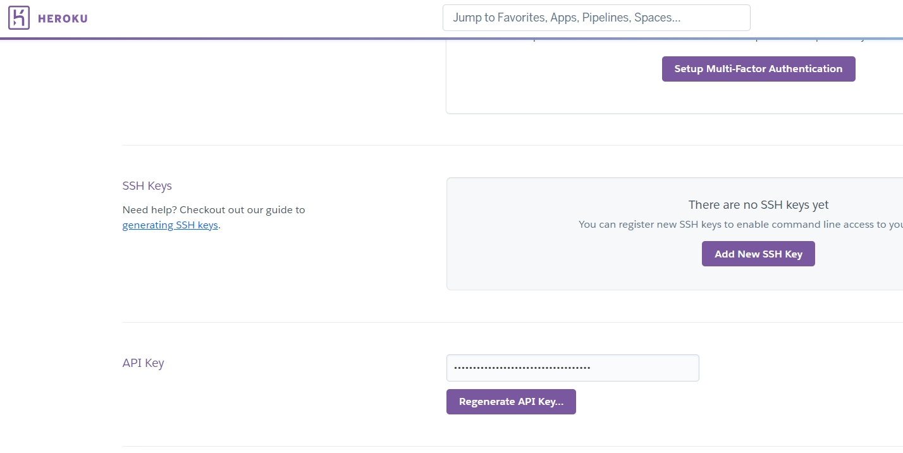
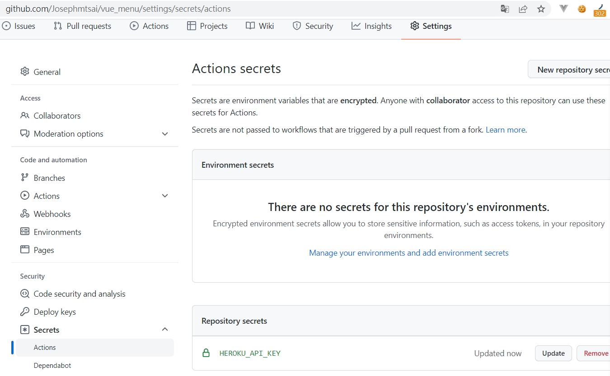

# vue_menu

Add git Action file

# 整合到 Heroku

1. Heroku API Key
   

2. 加到 GITHUB 自己的專案內 Action Secrets
   

3. 放到 build.yml
   > app_name 對應的是你創造的 heroku app name
   > HEROKU_API_KEY 是步驟 2 的設定

```
  deploy:
    needs: build
    runs-on: ubuntu-latest
    steps:
      - uses: actions/checkout@v2
      - uses: akhileshns/heroku-deploy@v3.12.12
        with:
          heroku_api_key: ${{secrets.HEROKU_API_KEY}}
          heroku_app_name: 'vue-menu'
          heroku_email: 'mmx362003@gmail.com'
          appdir: 'dist'
```

reference:
https://www.split.io/blog/node-js-continuous-deployment-jenkins-heroku/
