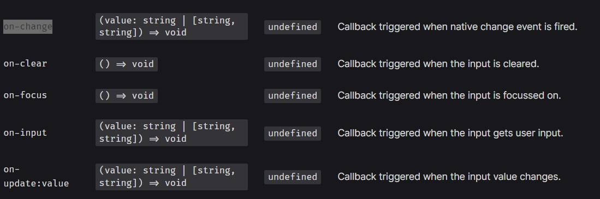
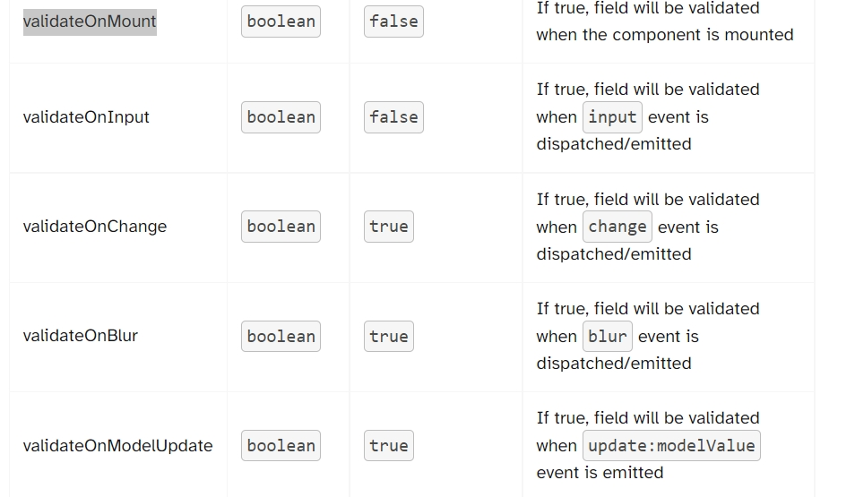

# Vee Validate 4 Guide

以下介紹都是以 options 寫法實作 + naive-ui 實作整合
[Demo](https://vue-menu.herokuapp.com/)

### install

npm i vee-validate --save

### yup

npm i yup --save

# Vee Validate Introduce

Vue 3 對應的是 Vee Validate 4
在 Vee Validate 4 中 .此套件把驗證規則跟表單的驗證拆開( 之前 Vee Validate3 是整合再一起)
所以簡單來說

1. Yup (驗證規則)
2. Vee Validate (表單驗證)

如果需要其他的驗證規則 官方有推薦另外兩個

1. [Zod Schema Validation](https://vee-validate.logaretm.com/v4/integrations/zod-schema-validation)
2. [Formvuelate Integration](https://vee-validate.logaretm.com/v4/integrations/formvuelate)

# Yup 介紹

[Yup](https://github.com/jquense/yup)

### Yup 需要先定義欄位的型別 .接著才是規則 EX:

```
password = yup.string().required().min(6).max(15)
```

> 代表此欄位字串是必填.有最小跟最大的長度
> 如果我們想要客製化錯誤訊息在內建的 Function 上面 可以在 function 內傳入錯誤訊息

```
.required('Required!!')
```

### 使用 match regux function

```
password: yup
    .string()
    .required('Please Enter your password')
    .matches(
      "^(?=.*[A-Za-z])(?=.*d)(?=.*[@$!%*#?&])[A-Za-zd@$!%*#?&]{8,}$",
      "Must Contain 8 Characters, One Uppercase, One Lowercase, One Number and one special case Character"
    )
```

> 使用的是 matches 第一個參數是 regx ,第二個是錯誤訊息

### 使用 custom fuction with async

```
yup.string().required('Required').test('checkEmailExist', 'Not Valid', this.isAvaibledEmail),
```

> 使用 test 第一個是此測試名稱 第二參數是錯誤訊息.第三是 function ,如果 return false 代表 failed

```
async isAvaibledEmail(value) {
      let result;
      console.log('Aysnc ' + value);
      await getRandomUserData(3).then((data) => {
        const userDataList = data.data.results;
        const userData = userDataList.filter((user) => {
          return !value.includes('example.com');
        });
        //console.log(userData);
        if (userData.length > 0) {
          result = true;
        } else {
          result = false;
        }
      });
      return result;
    }
```

# Field 介紹

[Props](https://vee-validate.logaretm.com/v4/api/field#props)

```
<template>
  <Field name="field" type="text" />
</template>
<script>
import { Field } from 'vee-validate';
export default {
  components: {
    Field,
  },
};
</script>
```

1. Field 如果沒有裡面沒有包任何 Component ,他會根據你 props define 的 "as" 自己生成一個 element
2. 因為我們是自己使用客製化套件 這裡主要是以套件介紹

```
<Field v-slot="{ field, errorMessage }" :validateOnInput="true" name="Password" type="Password">
    <n-card class="bg-gray-200 border-solid border-2" title="Password">
        <n-input type="password" v-bind="field" show-password-on="mousedown" placeholder="Password" />
        <template #footer>{{ errorMessage }} </template>
    </n-card>
</Field>
```

> 這裡先說明注意的事情
>
> 1. **綁定 value to custom component**
>    Field 提供 field ,errorMessage slot 給我們使用 我們需要把 field.value 綁訂到 custom component 的
>    :value="field.value" 讓 custom component 輸入的 value 可以回傳到 Field 身上 如果
>    是客製套件 需要透過這樣去綁定 :model-value="field.value" 看每一個套件用法
>    以圖下面 最主要 naive-ui 有三個 method 可以 Call back 給 Field 去更新資料
>    
> 2. **綁定其他事件到 custom component** > 
>    我們可以透過 v-bind 將所有事件綁入 或是可以單獨綁定
> 3. **rules** 綁定
>    如果沒有使用 Form 去綁定，可以單獨傳入到這個 props

# Form 介紹

我們要把剛剛介紹的東西串再一起
[Form](https://vee-validate.logaretm.com/v4/api/form#slots)

### Template

```
<Form class="w-full sm:min-w-[420px] sm:!max-w-[480px] mx-auto" v-slot="v" ref="myForm" :validation-schema="schema" :initial-values="formValues" @submit="onSubmit">
      <n-card title="Form Info"> {{ v }}} </n-card>
      <Field v-slot="{ field, errorMessage }" :validateOnInput="true" name="UserName" type="text">
        <n-card class="bg-gray-200 border-solid border-2" title="UserName">
          <n-input type="text" v-bind="field" show-password-on="mousedown" placeholder="UserName" />
          <template #footer>{{ errorMessage }} </template>
        </n-card>
      </Field>
</Form>
```

### Source Data (Schema, Init Value)

```
this.schema = yup.object({
      Email: yup.string().required('Required').test('checkEmailExist', 'Not Valid', this.isAvaibledEmail),
      EmailOnBlur: yup.string().required('Required'),
      Password: yup.string().required().min(6).max(15),
      PasswordConfirm: yup
        .string()
        .required()
        .oneOf([yup.ref('Password')], 'Passwords do not match'),
      Cities: yup.array().test('checkArrayRequired', 'Not Valid', this.checkArrayRequired),
      UserName: yup.string().required().min(3),
      AgreeTerms: yup.bool().isTrue(),
    });
    this.formValues = {
      Email: 'mmx362003@gmail.com',
      EmailOnBlur: 'mmx362003confirm@gmail.com',
      Password: '123233a',
      PasswordConfirm: '123233a',
      Cities: [],
      UserName: 'joseph',
      AgreeTerms: true,
    };
```

> 1. Schema 是最重要的部分，定義了每一個欄位套用什麼規則以及定義欄位的格式
> 2. formValues 這只是初始值(填與不填都可以)，最終還是透過 onSumbit 他會根據定義好的欄位 傳最後的 value 進去

設定好 1 跟 2 以後就可以
講解一下我們的範例
這裡舉了幾個比較常用的驗證欄位來舉例
[example](https://github.com/Josephmtsai/vue_menu/blob/master/src/views/VeeValidate.vue)

### Reference

https://pjchender.dev/npm/npm-yup/
https://www.naiveui.com/en-US/os-theme/components/input
https://www.itread01.com/question/N3NuaDA=.html
